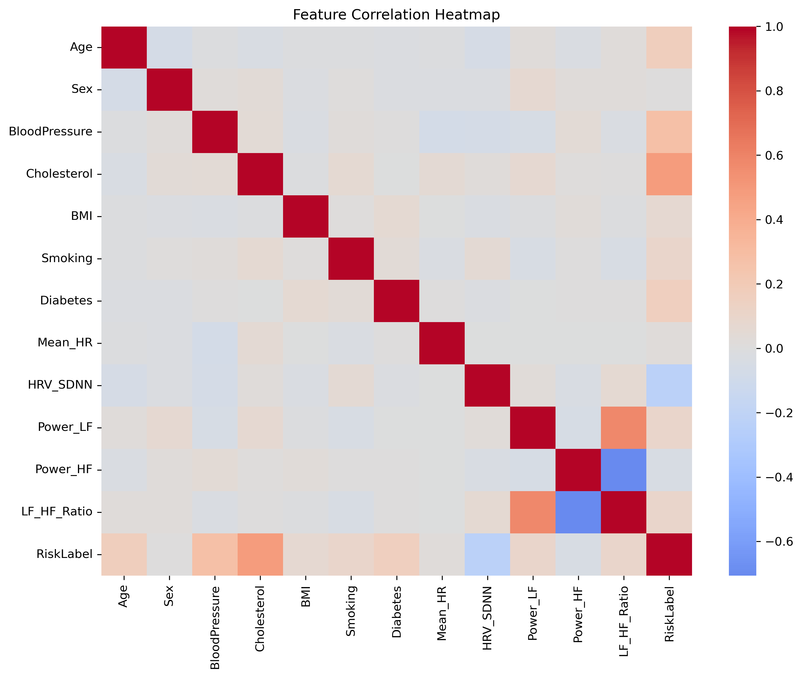
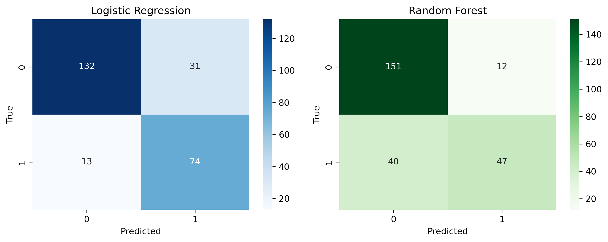

# 🩺 Multimodal Healthcare Risk Prediction

## 🧭 Project Overview

This project focuses on developing a machine learning workflow for **healthcare risk prediction**.  
The goal is to analyze patient data containing both **clinical indicators** (e.g., blood pressure, cholesterol) and **physiological signals** (e.g., heart rate variability, autonomic balance) to identify individuals at higher cardiovascular risk.

The pipeline covers the entire lifecycle, from data exploration to model training, ensuring both **accuracy** and **interpretability**, which are essential in medical applications.


---

## 📂 Project Structure

- **`src/exploratory_analysis.py`** — Exploratory data analysis, visualization, and correlation studies  
- **`src/model_training.py`** — Model training and evaluation (Logistic Regression & Random Forest)  

---

## 🧠 Data

Data files are **not included** in this repository for privacy reasons.  
To run the notebook, place your dataset in:


A **data dictionary** describing all features and units is available in:  
`docs/data_dictionary.md`

---
## 📊 Results and Visualizations

### 🔹 Correlation Heatmap
The heatmap below shows pairwise correlations between numerical features.  
Strong positive correlations (red) and negative correlations (blue) help reveal relationships among physiological and clinical variables.  
For instance, **LF_HF_Ratio** shows a moderate negative correlation with **Power_HF**, indicating inverse HRV behavior between frequency components.

<p align="center">
  
</p>

### 🔹 Model Performance (Confusion Matrices)
The following confusion matrices compare model predictions on the test set:

- **Left:** Logistic Regression  
- **Right:** Random Forest  

Random Forest achieved slightly better classification on both classes, showing higher true negatives and balanced sensitivity/specificity.

<p align="center">
  
</p>

---

## ⚙️ Quickstart

```bash
# 1. Clone the repository
git clone https://github.com/Arman-Rajaei/healthcare-risk-prediction.git
cd healthcare-risk-prediction

# 2. Install dependencies
pip install -r requirements.txt

# 3. Launch Jupyter Lab / Notebook
jupyter lab
